# 🌐 React로 만드는 Tic Tac Toe
> :bulb: React 공식 홈페이지의 튜토리얼에 따라서 코딩을 해봄으로써 기본적인 기능 구현을 익힘


> 목차

[toc]

---


## 📌 목표 : React 공식문서를 참고하여 Tic-Tac-Toe 게임 구현


### 1. 기본구조

- 초기코드는 공식문서에서 제공
- index.js는 3개의 클래스로 구성
  - Square
  - Board
  - Game


---


### 2. Props를 통해 데이터 전달하기


>  :bulb: 부모 Board 컴포넌트에서 자식 Square 컴포넌트로 "prop" 전달.


- Board

```react
class Board extends React.Component {
  renderSquare(i) {
    return <Square value={i} />;
  }
```

- Square

```react
class Square extends React.Component {
  render() {
    return (
      <button className="square">
        {this.props.value}
      </button>
    );
  }
}
```


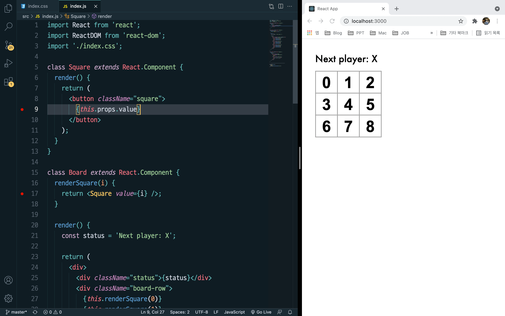


---


### 3. 사용자와 상호작용하는 컴포넌트 만들기


> :bulb:  화살표함수를 이용하여 Square에 클릭함수 적용.

- 주의❗️: 화살표 함수에서 "() =>" 을 넣어주지 않으면 컴포넌트가 다시 렌더링 될때 마다 경고창을 띄우게 됨!!

  

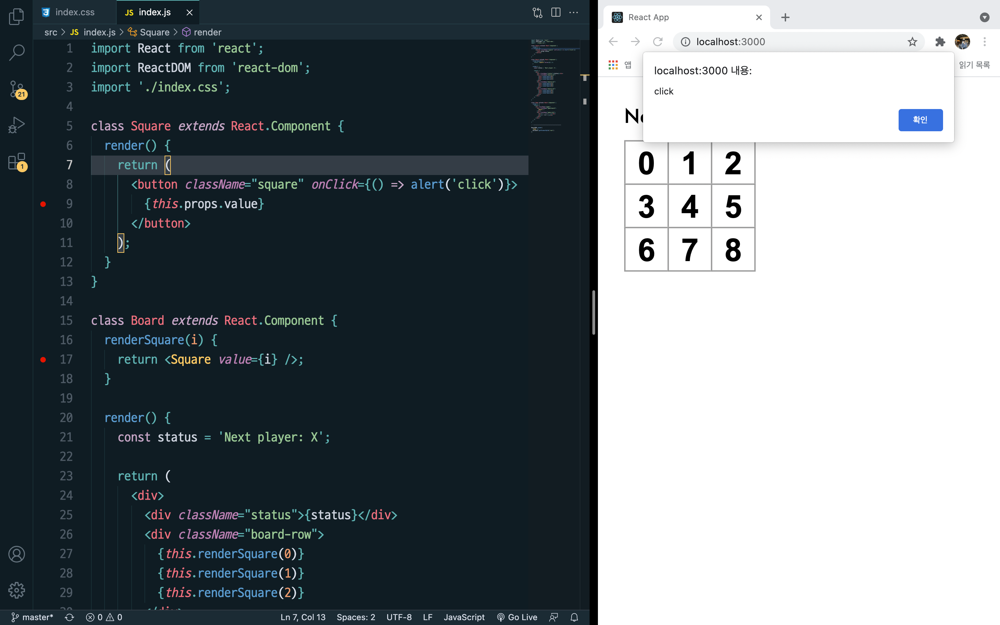


> :bulb:  클릭할 때 X 로 값이 변경될 수 있도록 구현

- 주의❗️ : 모든 React 컴포넌트 클래스는 `생성자`를 가질 때 `super(props)` 호출 구문부터 작성해야 합니다.


- Square클래스에 새로운 생성자 만들기

  ```react
    constructor(props) {
      super(props);
      this.state = {
        value: null,
      };
    }
  ```


- button 태그의 onClick 함수 수정.
  - 클릭했을 때 기존 생성자인 state의 값이 'X'로 바뀔 수 있도록.


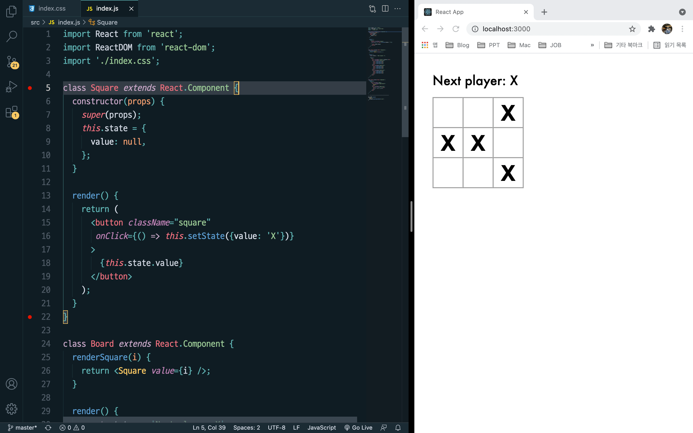

---


### 4. 개발자 도구

> :bulb: React Devtools 구글 크롬 확장 프로그램 설치


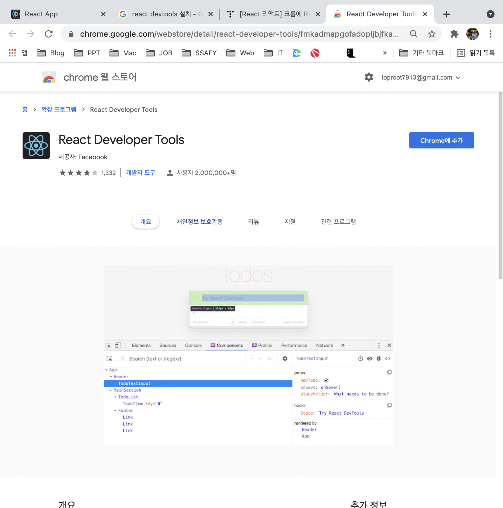


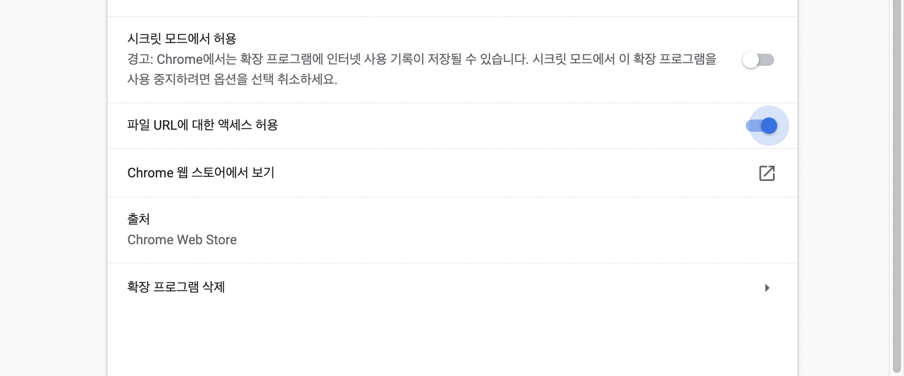


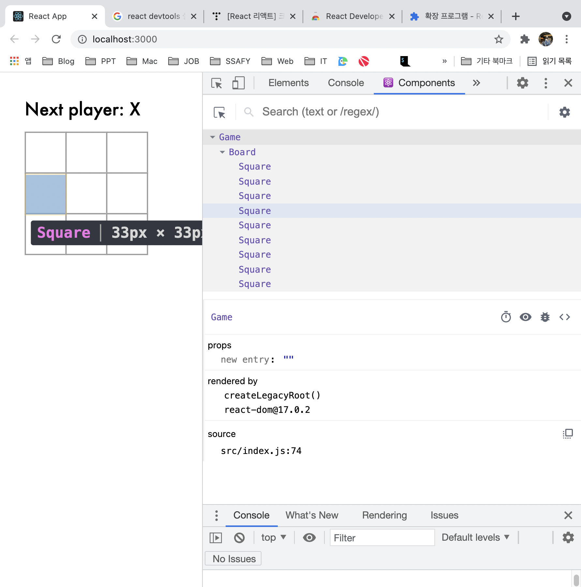


---


### 5. 게임 완성하기


- 승자를 확인하기 위해 여러개의 자식 컴포넌트들을 부모컴포넌트에 공유 state를 정의
- 부모 컴포넌트는 props를 사용하여 자식 컴포넌트에 state를 다시 전달 가능
- 이러한 방법으로 자식 컴포넌트들이 서로 또는 부모 컴포넌트와 동기화 하도록 함.


- Board에 생성자 추가하고 9개의 사각형에 해당하는 9개의 null 배열을 초기 state로 설정

  ```react
    constructor(props) {
      super(props);
      this.state = {
        squares: Array(9).fill(null),
      };
    }
  ```

  

- 기존에는 Square의 자체 state에 따라 'X' 표시로 바꾸고 있었음.

- 그동안 Square는 Board에서 전달하는 valeu prop을 무시한 상황

- Prop 전달방법을 다시 사용하기 위해 Board의 renderSquare를 다음과 같이 수정.

  ```react
    renderSquare(i) {
      return <Square value={this.state.squares[i]} />;
    }
  ```


- Square는 이제 빈 사각형에 'X', 'O', 또는 null인 value prop을 받음.

- 다음으로 Square를 클릭할 때 Board의 함수를 호출하여 값을 채워주기 위해 다음과 같이 수정.

  ```react
    renderSquare(i) {
      return (
        <Square
          value={this.state.squares[i]}
          onClick={() => this.handleClick(i)}
        />
      );
    }
  ```

  


- Square

  ```react
  class Square extends React.Component {
    constructor(props) {
      super(props);
      this.state = {
        value: null,
      };
    }
  
    render() {
      return (
        <button 
          className="square"
          onClick={() => this.props.onClick()}
        >
          {this.props.value}
        </button>
      );
    }
  }
  ```

- Board

  ```react
  class Board extends React.Component {
    constructor(props) {
      super(props);
      this.state = {
        squares: Array(9).fill(null),
      };
    }
    handleClick(i) {
      const squares = this.state.squares.slice();
      squares[i] = 'X';
      this.setState({squares: squares});
    }
    
    renderSquare(i) {
      return (
        <Square 
          value={this.state.squares[i]}
          onClick={() => this.handleClick(i)}
        />
      );
    }
  ```


> :bulb:  현재까지 정리


- 각 사각형의 state가 Board 컴포넌트에 저장.
- Board의 상태가 변화면 Square 컴포넌트는 자동 렌더링
- Board 컴포넌트의 모든 사각형의 상태를 유지하는 것으로 이후에 승자를 결정 가능
- Square 컴포넌트는 더이상 state를 유지하지 않기 때문에 Board 컴포넌트의 값을 받고, 정보 전달
- Board는 이제 Sqaure를 완전히 제어하므로 이러한 것을 react용어로 **제어되는 컴포넌트** 라고 함.

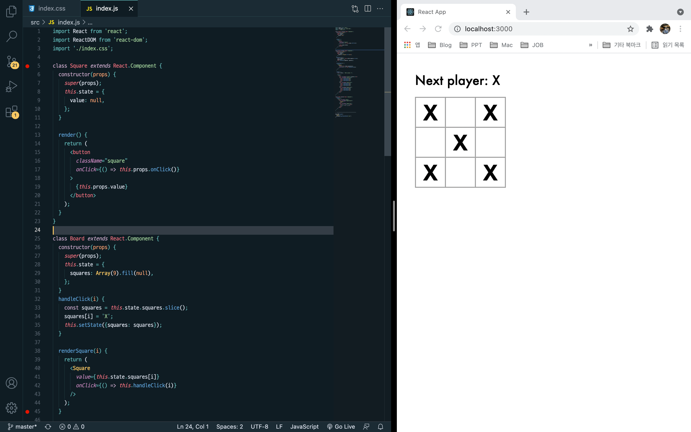


---


### 6. 함수 컴포넌트


- 기존에 작성했던 Square클래스를 props를 입력받아서 렌더링할 대상을 반환하는 함수로 작성
- 클래스로 작성하는 것보다 빠르게 작성할 수 있고, 많은 컴포넌트를 함수 컴포넌트로 표현 가능


```react
function Square(props) {
  return (
    <button className="square" onClick={props.onClick}>
      {props.value}
    </button>
  )
}
```


---


### 7. 순서 만들기


- 게임판에 현재 'X'만 나타나고 있는데 "O"를 표시되도록 수정
- 먼저 생성자에 xIsNext를 추가해주고 handleClick으로 "X", "O"가 번갈아가면서 나타나도록 구현.


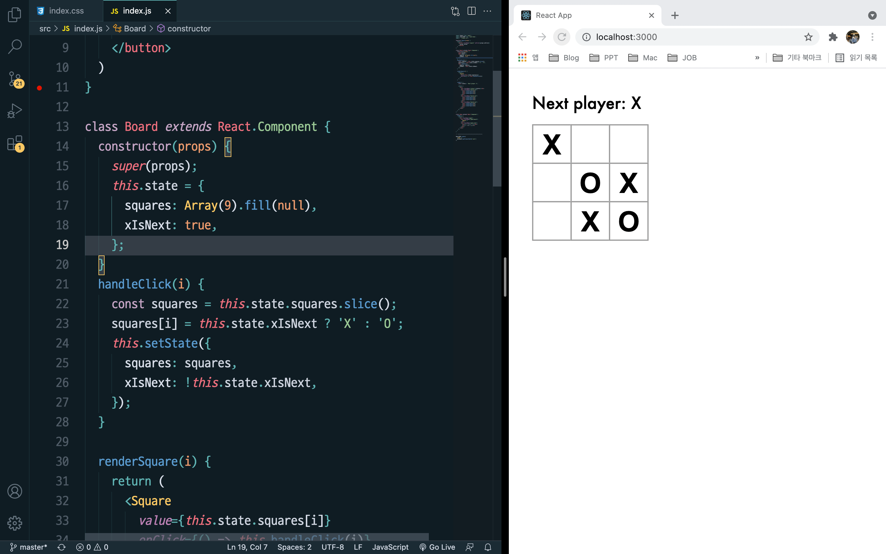


- Board의 `render` 안에 있는 “status” 텍스트도 바꿔서 어느 플레이어가 다음 차례인지 출력

  ```react
    render() {
      const status = 'Next player: ' + (this.state.xIsNext ? 'X' : 'O');
  ```

  


---


### 8. 승자 결정하기


- 승부가 나는 때와 더이상 둘 곳이 없을 때를 알려주어 승부 결정하기

- 9개의 사각형 배열을 가지고 함수는 승자를 확인하여 적절한 값으로 'X', 'O' 또는 null을 반환.

  ```react
  function calculateWinner(squares) {
    const lines = [
      [0, 1, 2],
      [3, 4, 5],
      [6, 7, 8],
      [0, 3, 6],
      [1, 4, 7],
      [2, 5, 8],
      [0, 4, 8],
      [2, 4, 6],
    ];
    for (let i = 0; i < lines.length; i++) {
      const [a, b, c] = lines[i];
      if (squares[a] && squares[a] === squares[b] && squares[a] === squares[c]) {
        return squares[a];
      }
    }
    return null;
  }
  ```


- 어떤 플레이어가 우승했는지 확인하기 위해 Board의 render 함수에서 calcuateWinner(squares) 호출

  ```react
      const winner = calculateWinner(this.state.squares);
      let status;
      if (winner) {
        status = 'Winner: ' + winner;
      } else {
        status = 'Next player: ' + (this.state.xIsNext ? 'X' : 'O');
      }
  ```

- 누군가가 승리하거나 이미 Square가 채워져 있느 상황에서는 handleClick 함수가 무시되도록 변경

  ```react
      if (calculateWinner(squares) || squares[i]) {
        return;
      }
  ```


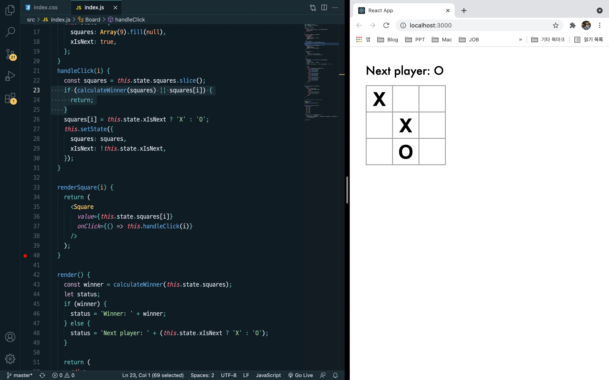


---


### 9. 시간 여행 추가하기


> :bulb: 동작에 대한 기록 저장하기


- 공식문서 "불변성"

  https://ko.reactjs.org/tutorial/tutorial.html#why-immutability-is-important


- Slice()를 사용해 매 동작 이후에 square의 새로운 복사본을 불변객체로 취급하여 History 배열에 저장


> :bulb: 다시 State 끌어올리기

- Game 클래스 내 생성자 생성

  ```react
  class Game extends React.Component {
    constructor(props) {
      super(props);
      this.state = {
        history: [{
          squares: Array(9).fill(null),
        }],
        xIsNext: true,
      };
    }
  ```

- Game 컴포넌트에서 Board컴포넌트로 squares와 onClick poprs를 전달하기 위해 Board 컴포넌트 return 수정

  ```react
  value={this.props.squares[i]}
  onClick={() => this.props.onClick(i)}
  ```

- Game 컴포넌트의 `render` 함수를 가장 최근 기록을 사용하도록 업데이트하여 게임의 상태를 확인하고 표시

  ```react
    render() {
      const history = this.state.history;
      const current = history[history.length - 1];
      const winner = calculateWinner(current.squares);
      let status;
      if (winner) {
        status = 'Winner: ' + winner;
      } else {
        status = 'Next player: ' + (this.state.xIsNext ? 'X' : 'O');
      }
  
      return (
        <div className="game">
          <div className="game-board">
            <Board
              squares={current.squares}
              onClick={(i) => this.handleClick(i)}
            />
          </div>
          <div className="game-info">
            <div>{status}</div>
            <ol>{/* TODO */}</ol>
          </div>
        </div>
      );
    }
  ```

- Game 컴포넌트의 `render` 함수를 가장 최근 기록을 사용하도록 업데이트하여 게임의 상태를 확인하고 표시하겠습니다.

  ```react
   render() {
      const history = this.state.history;
      const current = history[history.length - 1];
      const winner = calculateWinner(current.squares);
      let status;
      if (winner) {
        status = 'Winner: ' + winner;
      } else {
        status = 'Next player: ' + (this.state.xIsNext ? 'X' : 'O');
      }
  
      return (
        <div className="game">
          <div className="game-board">
            <Board
              squares={current.squares}
              onClick={(i) => this.handleClick(i)}
            />
          </div>
          <div className="game-info">
            <div>{status}</div>
            <ol>{/* TODO */}</ol>
          </div>
        </div>
      );
    }
  ```

  

- Board의 handleClick 함수를 Game으로 옮겨주고 render의 중복되는 코드를 제거해줍니다.


> :bulb: 과거의 이동 표시하기


- JS의 map() 함수를 가지고 클릭한 기록을 남겨주는 history를 map 하기

  ```react
      const moves = history.map((step, move) => {
        const desc = move ?
          'Go to move #' + move :
          'Go to game start';
        return (
          <li>
            <button onClick={() => this.jumpTo(move)}>{desc}</button>
          </li>
        );
      });
  ```

  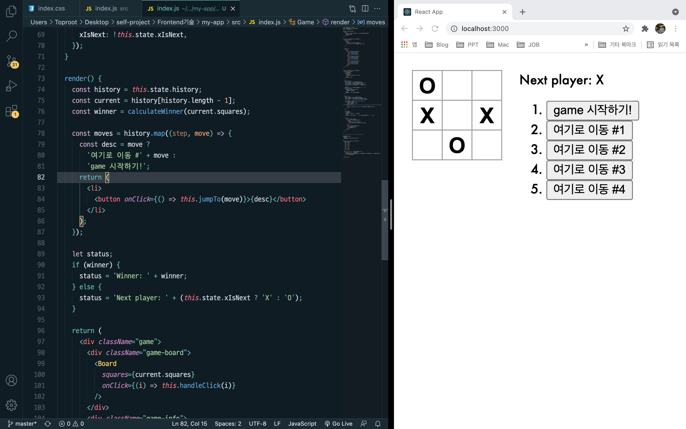


> :bulb: 시간여행 구현하기


- 시간기록을 클릭하면 그 전단계로 이동하기 위해 다음과 같은 함수를 설정

  ```react
    jumpTo(step) {
      this.setState({
        stepNumber: step,
        xIsNext: (step % 2) === 0,
      });
    }
  ```

  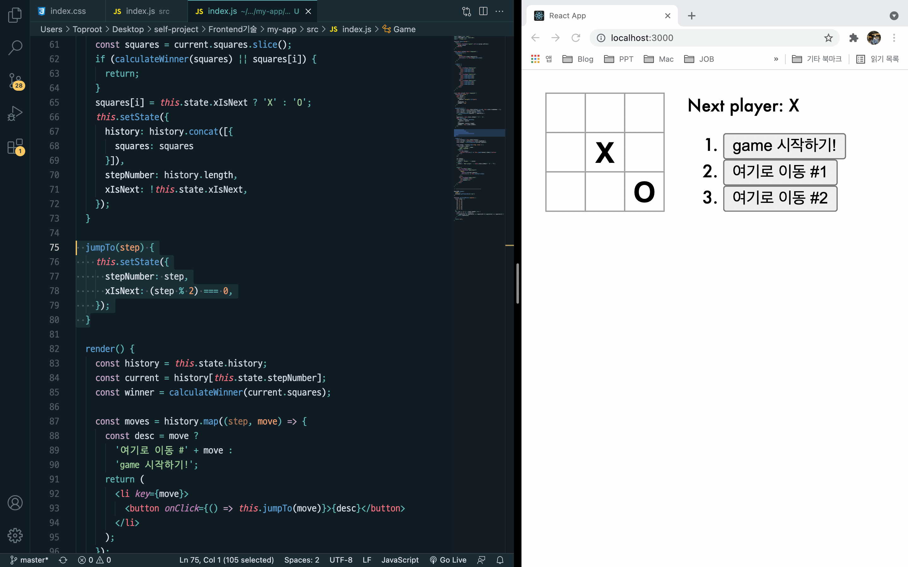


---


### 10. 마무리

​	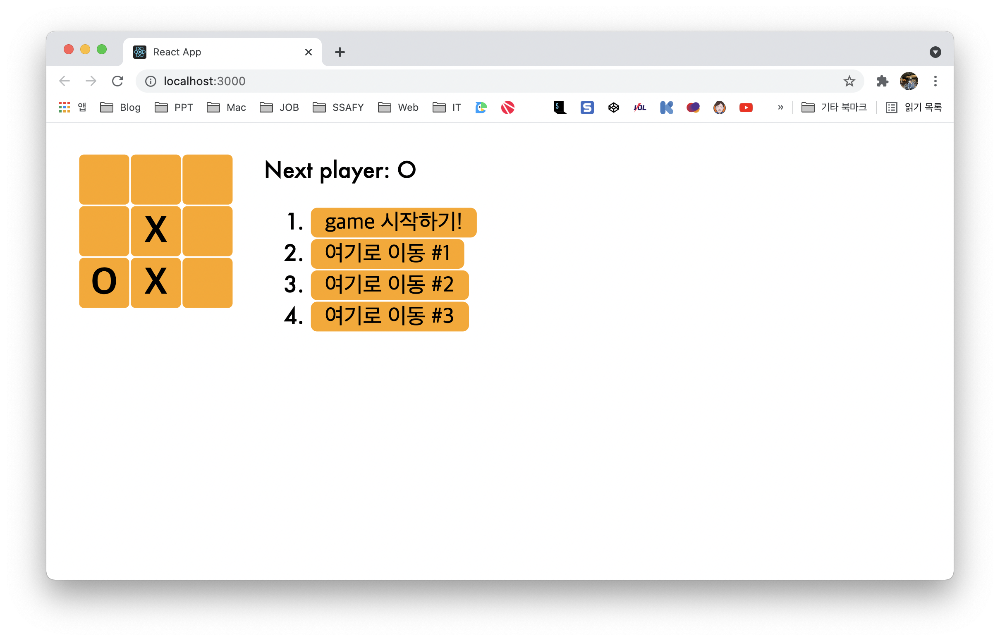


> ⛱ 학습내용 정리


- Props를 통한 컴포넌트간의 데이터 전달

- 부모-자식 관계를 통한 컴포넌트 제어

- .slice()연산자를 사용한 square배열 사본 만들기를 통해 배운 '불변성'

  - https://ko.reactjs.org/tutorial/tutorial.html#why-immutability-is-important

  - 복잡한 특징들을 단순하게 만듦
  - 변화를 감지함
  - React에서 다시 렌더링하는 시기를 결정함

- 시간여행 기능을 만들면서 배운 '동작에 대한 기록 저장하기'

- 동적인 리스트를 만들때 할당하는 '키' 개념

  - https://ko.reactjs.org/tutorial/tutorial.html#picking-a-key


> ⛱ 느낀점.


Vue를 활용할 때 보다 JS에 대한 이해가 더욱 중요하다는 것을 느꼈습니다.

전체적인 component 구조가 Vue보다 유연한 구조를 가지고 있었고, 데이터 활용 측면에서 더 활용성이 좋은 것 같았습니다.

일단 간단한 튜토리얼 정도만 학습하였는데, 

bootstrap이나 Sass와 같은 패키지를 활용해서 더욱 반응성이 좋은 기능들은 조금 더 공부해 보고 싶었습니다.


